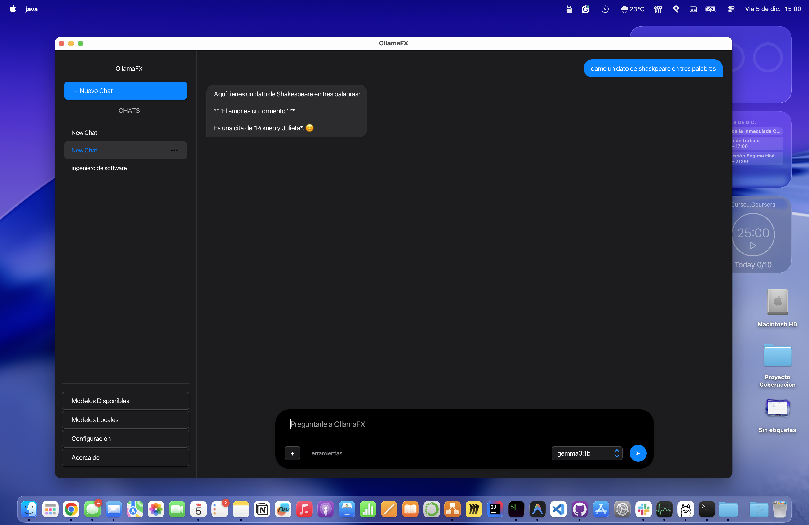
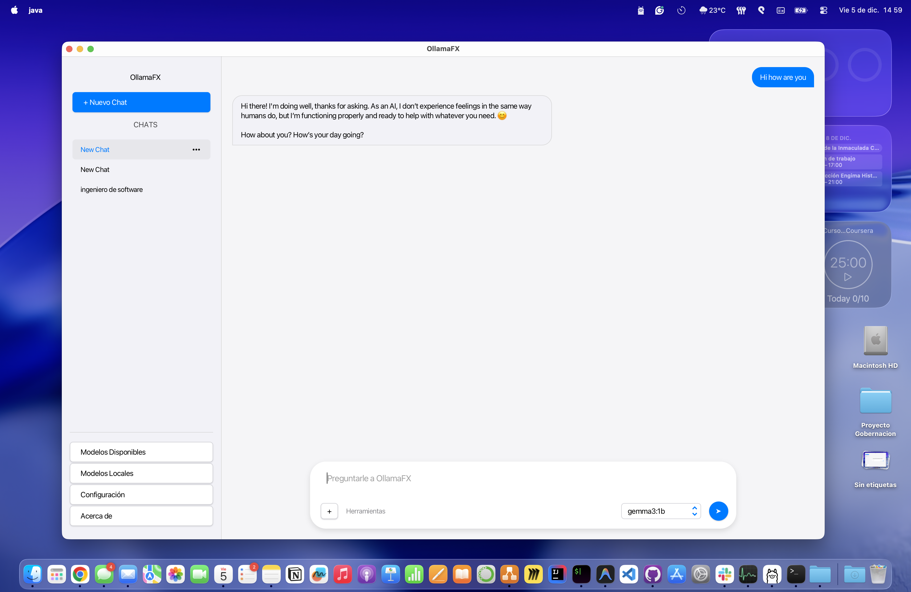
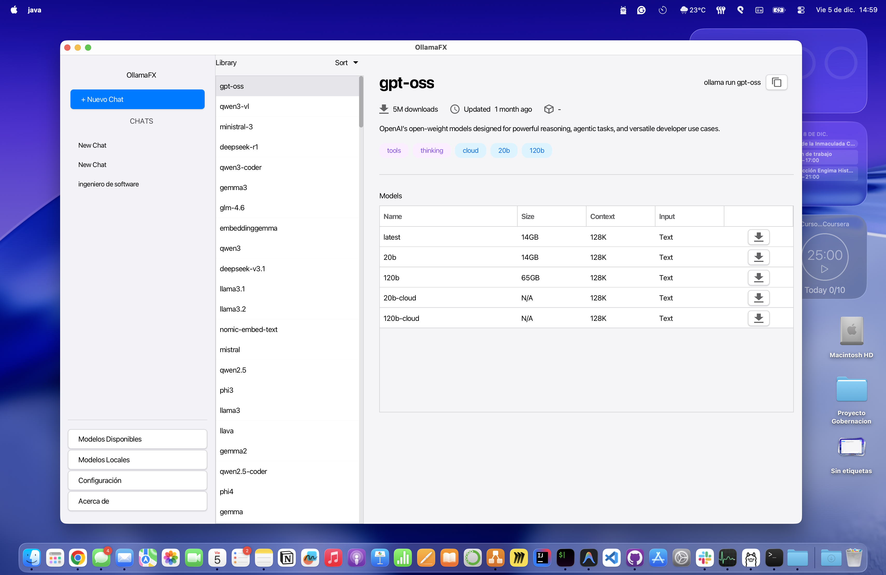
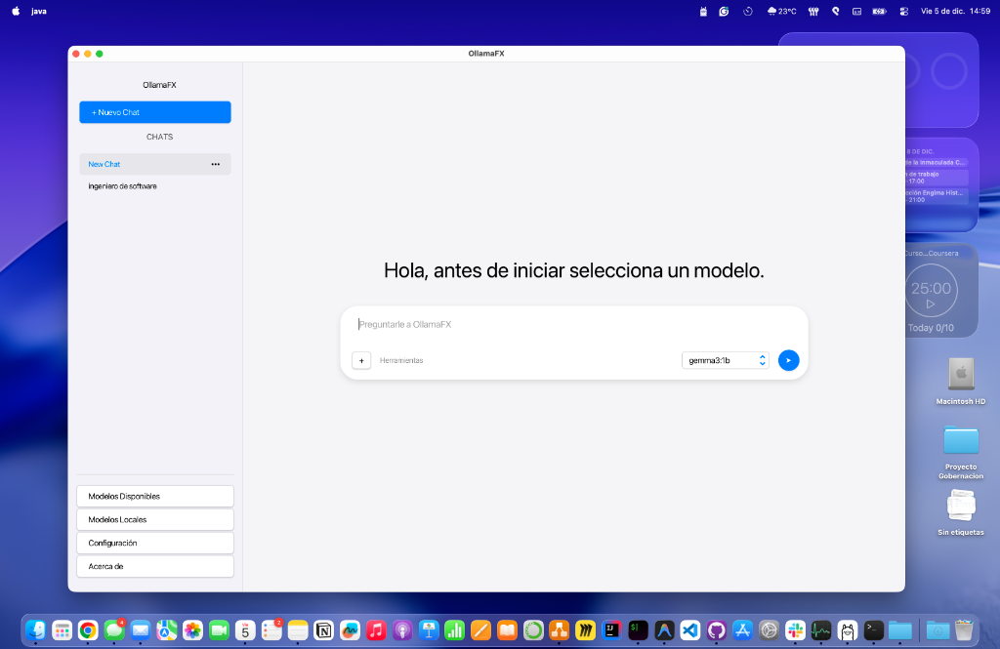

# OllamaFX 🦙✨


**OllamaFX** is a modern, native desktop client for [Ollama](https://ollama.com/), built with JavaFX. It provides a beautiful, user-friendly interface to manage your local LLMs and chat with them, featuring a sleek GNOME/Adwaita-inspired design.

## ✨ Features

*   **🎨 Modern UI:** Clean, responsive interface inspired by GNOME Adwaita, with full **Light/Dark mode** support.
*   **📦 Model Management:**
    *   **Install:** Browse the Ollama library and download models with a real-time progress popup.
    *   **Manage:** View installed models, check details (size, format), and uninstall them easily.
    *   **Instant Feedback:** The UI updates instantly upon installation or deletion.
*   **💬 Chat Interface:**
    *   Create multiple chat sessions.
    *   **Pin**, **Rename**, and **Delete** chats.
    *   Clean message bubbles with distinct styles for user and AI.
*   **🛠️ Tech Stack:** Built on the robust JavaFX platform, utilizing `ollama4j` for API interaction and `AtlantaFX` for theming.

## � Screenshots

 
Dark Chat Interface


Light Chat Interface

 
Library Models Ollama


Init Chat 

## �🚀 Getting Started

### Prerequisites

*   **Java 17** or higher installed.
*   **Ollama** installed and running locally (`ollama serve`).

### 📥 Download & Install

1.  Go to the [Releases Page](../../releases) and download the latest `.zip` file (e.g., `OllamaFX-0.2.0-Dist.zip`).
2.  Unzip the file to a folder of your choice.

### ▶️ How to Run

We have included easy-to-use scripts for every platform. Just navigate to the unzipped folder and:

*   **macOS:** Double-click `run_macOS.command`.
*   **Windows:** Double-click `run_windows.bat`.
*   **Linux:** Run `./run_Linux.sh`.

> **Note:** On macOS, if you see a security warning, you may need to right-click the script and select "Open" the first time.

## 👨‍💻 Development

If you want to build the project from source:

1.  **Clone the repository:**
    ```bash
    git clone https://github.com/fredericksalazar/OllamaFX.git
    cd OllamaFX
    ```

2.  **Run locally:**
    ```bash
    ./gradlew run
    ```

3.  **Build Distribution:**
    ```bash
    ./gradlew packageDistribution
    ```
    This generates the cross-platform ZIP in `build/distributions` (and copies it to `releases/`).

## 🤝 Contributing

Contributions are welcome! Please follow our standard flow:

1.  Fork the project.
2.  Create your feature branch (`git checkout -b feature/AmazingFeature`).
3.  Commit your changes (`git commit -m 'Add some AmazingFeature'`).
4.  Push to the branch (`git push origin feature/AmazingFeature`).
5.  Open a Pull Request.

## 📄 License

Distributed under the MIT License. See `LICENSE` for more information.

---
*Built with ❤️ by the OllamaFX Team.*
